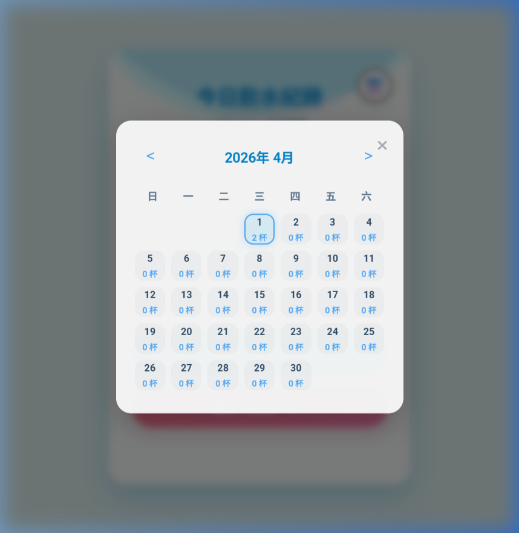

# 💧 DrinkWater (飲水紀錄)

一個簡潔、帶有現代化動畫以及極具互動性的個人飲水追蹤 Web 應用程式。幫助你記錄每天的水分攝取量，並藉由充滿治癒感的水波漲潮動畫來激勵自己的健康習慣！

<p align="center">
  
</p>

## ✨ 核心特色 (Features)

* **互動水位動畫**：每次點擊紀錄，中央杯中的水量會平滑而優雅地上升，搭配完全利用 CSS 與 SVG 演算的「真實海浪波動」，讓喝水成為視覺上的享受。
* **歷史月曆回顧**：內建直覺的行事曆視圖（Modal UI），點開右上角按鈕就能輕鬆掌控整個月份每一天的飲水杯數紀錄，並支援跨月切換。
* **時光機補登模式**：直接點選行事曆上的特定歷史日期，就能將主畫面無縫切換為「補登模式」。進行往日水量的「補登」與「撤回」操作。
* **防呆撤銷機制**：畫面貼心備有帶紅粉漸層的「減少一杯水」按鍵，若是不小心多按了一次，隨時都能反悔取消並連帶退回動畫。
* **本地化永久儲存**：結合 `SQLite` 技術，所有點滴紀錄都能透過本地輕量資料庫保存下來。

## 📸 畫面預覽 (Screenshots)

### 歷史月曆介面 (Calendar View)
具備高質感玻璃擬態 (Glassmorphism) 風格的彈出視窗，讓介面既柔和又現代。
<p align="center">
  
</p>

## 🛠️ 開發與技術堆疊 (Tech Stack)

此專案由原生語言獨立打造，不仰賴龐大的前端框架，卻能表現卓越效能並展現毫不遜色的 UI/UX 設計：

- **Frontend (前端)**
  -  Vanilla JavaScript (純 JS 控制 API 串接與動態 DOM 狀態流轉)
  -  CSS3 (利用 CSS Keyframes/Transitions 加上 SVG Mask 架構出擬真的動態海浪波紋與懸浮效果)
  -  HTML5 

- **Backend (後端)**
  -  `Node.js` + `Express.js` (RESTful API 後端點建立與資料控管)
  -  `sqlite3` (輕巧強大且不需額外伺服器的檔案資料庫引擎)

## 🚀 快速安裝與啟動 (Quick Start)

### 1. 下載與安裝依賴套件
確定您已安裝好 [Node.js](https://nodejs.org/en/) 後，進入專案根目錄執行安裝指令：
```bash
# 安裝所需依賴 (包含 Express 框架與 SQLite3 連線元件)
npm install
```

### 2. 啟動伺服器
```bash
npm start
```

### 3. 開始使用
當終端機顯示 `Server is running at http://localhost:3000` 後，開啟您的瀏覽器前往以下網址，即可刻享受追蹤喝水的樂趣：
👉 **http://localhost:3000**

*(註：第一次啟動時，應用程式會非常聰明地自動幫您建立 `database.sqlite` 本地資料庫。)*

## 📂 專案結構 (Project Structure)

```text
DrinkWater/
├── package.json         # 專案依賴與腳本定義設定檔
├── server.js            # Express API 伺服器端與 SQLite3 SQL 資料庫查詢邏輯
├── public/              # 存放前端靜態檔案的目錄
│   ├── index.html       # 網頁主骨架、補登按鈕與 Modal 彈出組件
│   ├── style.css        # 全站樣式、UI 主題色調配置與 SVG 波浪動畫核心
│   └── script.js        # 前端狀態管理（今日/歷史模式）、日曆繪製與 Fetch API 存取
└── assets/              # README 展示預覽用圖影檔
```
